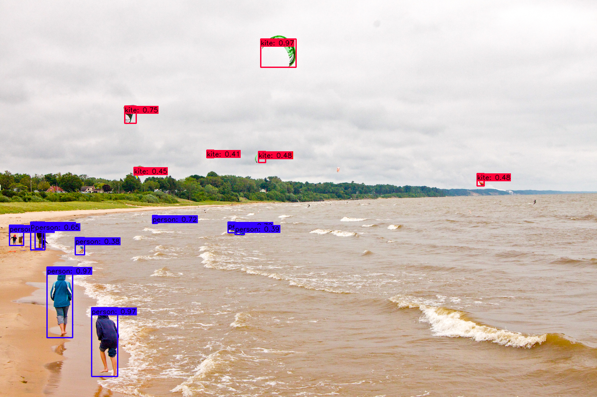
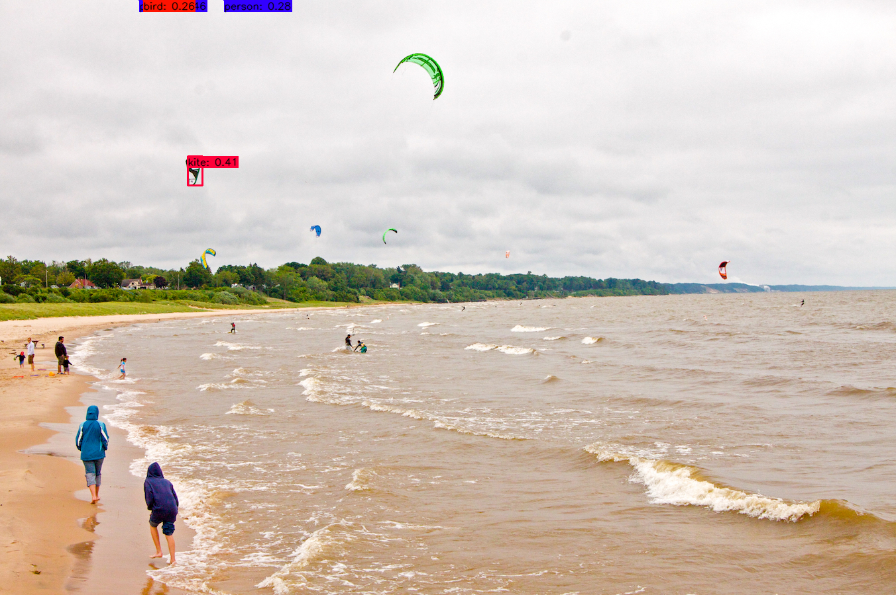

# tensorflow-yolov4-tflite
[](LICENSE)

YOLOv4, YOLOv4-tiny Implemented in Tensorflow 2.0. 
Convert YOLO v4, YOLOv3, YOLO tiny .weights to .pb, .tflite and trt format for tensorflow, tensorflow lite, tensorRT.

Download yolov4.weights file: https://github.com/AlexeyAB/darknet?tab=readme-ov-file#how-to-evaluate-fps-of-yolov4-on-gpu


### Prerequisites
* All of the dependencies are listed in the conda-env.yml file

You can install a conda environment to run the scripts in this repo by using the `conda-env` yaml file.
```bash
# Navigate to the folder where you cloned the repo and from there run:
conda env create --name my_env --file conda-env.yml
```

### Performance
<p align="center"></p>

### Demo

```bash
# Convert darknet weights to tensorflow
## yolov4
python save_model.py --weights ./data/yolov4.weights --output ./checkpoints/yolov4-416 --input_size 416 --model yolov4 

## yolov4-tiny
python save_model.py --weights ./data/yolov4-tiny.weights --output ./checkpoints/yolov4-tiny-416 --input_size 416 --model yolov4 --tiny

# Run demo tensorflow
python detect.py --weights ./checkpoints/yolov4-416 --size 416 --model yolov4 --image ./data/kite.jpg

python detect.py --weights ./checkpoints/yolov4-tiny-416 --size 416 --model yolov4 --image ./data/kite.jpg --tiny

```
If you want to run yolov3 or yolov3-tiny change ``--model yolov3`` in command

#### Output

##### Yolov4 original weight
<p align="center"></p>

##### Yolov4 tflite int8
<p align="center"></p>

### Convert to tflite

```bash
# Save tf model for tflite converting
python save_model.py --weights ./data/yolov4.weights --output ./checkpoints/yolov4-416 --input_size 416 --model yolov4 --framework tflite

# yolov4
python convert_tflite.py --weights ./checkpoints/yolov4-416 --output ./checkpoints/yolov4-416.tflite

# yolov4 quantize float16
python convert_tflite.py --weights ./checkpoints/yolov4-416 --output ./checkpoints/yolov4-416-fp16.tflite --quantize_mode float16

# Run demo tflite model
python detect.py --weights ./checkpoints/yolov4-416.tflite --size 416 --model yolov4 --image ./data/kite.jpg --framework tflite
```
### Additional steps for int8 quantization
This assumes you already have downloaded the weights and created a tensorflow checkpoint (first line in FIRST bash 'script').
**Note** I just noticed this is not converting into tflite framework but not sure if that's an issue, I'll check ASAP.
Since int8 quantization requires a subset of the dataset as "representative data" to tune the quantization to, you first have to do some preprocessing of the dataset. In this case we use the Coco dataset. You can simply follow these steps:
```bash
# Important to run the scripts from scripts folder!
cd scripts
# Download the dataset
source get_coco_dataset_2017.sh
# Create a pickle representation for the dataset
python coco_convert.py 
# Convert the annotations to txt (used when converting to tflite)
python coco_annotation.py
```

Now you can proceed to quantize yolo to int8 parameters and run the demo (assumes you're back to the root directory of the repo).
```bash
# yolov4 quantize int8
python convert_tflite.py --weights ./checkpoints/yolov4-416 --output ./checkpoints/yolov4-416-int8.tflite --quantize_mode int8 --dataset ./data/dataset/coco/val2017.txt

# Run demo (make sure the right weight checkpoints are used! Note the int8 in the name)
python detect.py --weights ./checkpoints/yolov4-416-int8.tflite --size 416 --model yolov4 --image ./data/kite.jpg --framework tflite --output result-int8.png
```


### Convert to TensorRT
```bash# yolov3
python save_model.py --weights ./data/yolov3.weights --output ./checkpoints/yolov3.tf --input_size 416 --model yolov3
python convert_trt.py --weights ./checkpoints/yolov3.tf --quantize_mode float16 --output ./checkpoints/yolov3-trt-fp16-416

# yolov3-tiny
python save_model.py --weights ./data/yolov3-tiny.weights --output ./checkpoints/yolov3-tiny.tf --input_size 416 --tiny
python convert_trt.py --weights ./checkpoints/yolov3-tiny.tf --quantize_mode float16 --output ./checkpoints/yolov3-tiny-trt-fp16-416

# yolov4
python save_model.py --weights ./data/yolov4.weights --output ./checkpoints/yolov4.tf --input_size 416 --model yolov4
python convert_trt.py --weights ./checkpoints/yolov4.tf --quantize_mode float16 --output ./checkpoints/yolov4-trt-fp16-416
```

### Evaluate on COCO 2017 Dataset
```bash
# run script in /script/get_coco_dataset_2017.sh to download COCO 2017 Dataset
# preprocess coco dataset
cd data
mkdir dataset
cd ..
cd scripts
python coco_convert.py 
python coco_annotation.py 
cd ..

# evaluate yolov4 model
python evaluate.py --weights ./data/yolov4.weights
cd mAP/extra
python remove_space.py
cd ..
python main.py --output results_yolov4_tf
```
#### mAP50 on COCO 2017 Dataset

| Detection   | 512x512 | 416x416 | 320x320 |
|-------------|---------|---------|---------|
| YoloV3      | 55.43   | 52.32   |         |
| YoloV4      | 61.96   | 57.33   |         |

### Benchmark
```bash
python benchmarks.py --size 416 --model yolov4 --weights ./data/yolov4.weights
```
#### TensorRT performance
 
| YoloV4 416 images/s |   FP32   |   FP16   |   INT8   |
|---------------------|----------|----------|----------|
| Batch size 1        | 55       | 116      |          |
| Batch size 8        | 70       | 152      |          |

#### Tesla P100

| Detection   | 512x512 | 416x416 | 320x320 |
|-------------|---------|---------|---------|
| YoloV3 FPS  | 40.6    | 49.4    | 61.3    |
| YoloV4 FPS  | 33.4    | 41.7    | 50.0    |

#### Tesla K80

| Detection   | 512x512 | 416x416 | 320x320 |
|-------------|---------|---------|---------|
| YoloV3 FPS  | 10.8    | 12.9    | 17.6    |
| YoloV4 FPS  | 9.6     | 11.7    | 16.0    |

#### Tesla T4

| Detection   | 512x512 | 416x416 | 320x320 |
|-------------|---------|---------|---------|
| YoloV3 FPS  | 27.6    | 32.3    | 45.1    |
| YoloV4 FPS  | 24.0    | 30.3    | 40.1    |

#### Tesla P4

| Detection   | 512x512 | 416x416 | 320x320 |
|-------------|---------|---------|---------|
| YoloV3 FPS  | 20.2    | 24.2    | 31.2    |
| YoloV4 FPS  | 16.2    | 20.2    | 26.5    |

#### Macbook Pro 15 (2.3GHz i7)

| Detection   | 512x512 | 416x416 | 320x320 |
|-------------|---------|---------|---------|
| YoloV3 FPS  |         |         |         |
| YoloV4 FPS  |         |         |         |

### Traning your own model
```bash
# Prepare your dataset
# If you want to train from scratch:
In config.py set FISRT_STAGE_EPOCHS=0 
# Run script:
python train.py

# Transfer learning: 
python train.py --weights ./data/yolov4.weights
```
The training performance is not fully reproduced yet, so I recommended to use Alex's [Darknet](https://github.com/AlexeyAB/darknet) to train your own data, then convert the .weights to tensorflow or tflite.


### TODO
* [x] Convert YOLOv4 to TensorRT
* [x] YOLOv4 tflite on android
* [ ] YOLOv4 tflite on ios
* [x] Training code
* [x] Update scale xy
* [ ] ciou
* [ ] Mosaic data augmentation
* [x] Mish activation
* [x] yolov4 tflite version
* [x] yolov4 in8 tflite version for mobile

### References

  * YOLOv4: Optimal Speed and Accuracy of Object Detection [YOLOv4](https://arxiv.org/abs/2004.10934).
  * [darknet](https://github.com/AlexeyAB/darknet)
  
   My project is inspired by these previous fantastic YOLOv3 implementations:
  * [Yolov3 tensorflow](https://github.com/YunYang1994/tensorflow-yolov3)
  * [Yolov3 tf2](https://github.com/zzh8829/yolov3-tf2)
